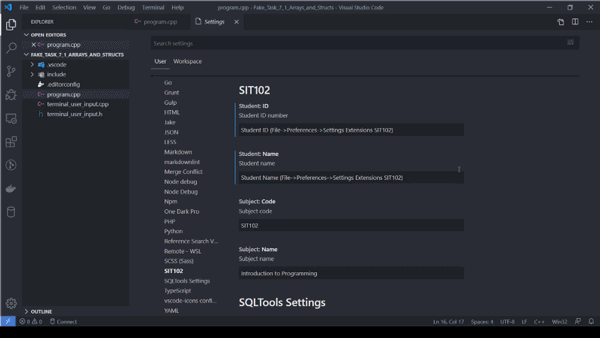

# SIT102 - File Comment Insert

This extension inserts SIT102 assignment specific comments and docstrings into C/C++ and Python files.

The extension assumes that the Splashkit project is created in a folder named after the exercise being completed. If not, any of the fields can be updated after the comment is inserted into the file.

## Configuration

Add your name and student ID to the SIT102 settings.

To do this, in VS Code:

* Select `File->Preferences->Settings`
* Look in the Extensions section for `SIT102`
* Update the `Name` and `ID` fields

Default settings are provided, however a the values can be changed to tailor the output.

## Use

To access the commands:

* With a program file open
* Access the command palette with `View->Command Palette` or `Ctrl+Shift+P` or `F1`
* Begin typing `SIT102`
* Three commands are available:
    1. SIT102 Insert File Comment
    2. SIT102 Insert Procedure or Function Comment
    3. SIT102 Insert Enum or Struct Comment

Shortcut keys are also available

1. Insert file comment:                   `Alt+Shift+F`
2. Insert procedure or function comment:  `Alt+Shift+P`
3. Insert enum or struct comment:         `Alt+Shift+S`

For inserting a file comment, the comment will be automatically inserted at the top of the file.

For inserting a procedure or function comment, place the cursor on the signature row of the procedure or function declaration (ie. the first row of the procedure or function).

For inserting an enum or struct comment, place the cursor on the first row of the enum or struct declaration.

For an example:



## Example File Level Comments

### C/C++

At the top of a .h, .hpp or .cpp file, the following comment will be inserted:

```cpp
/**  
 * SIT102 - Introduction to Programming  
 *  
 * Exercise:       7_1_Arrays_and_Structs  
 * Student Name:   John Doe  
 * Student ID:     22000000  
 */
```

### Python

At the top of a .py file, the following docstring will be inserted:

```python
"""SIT102 - Introduction to Programming  

 Exercise:       8_1_Reading_Another_Language  
 Student Name:   Jane Doe  
 Student ID:     22000001  
"""
```

For further information on the format, refer to [PEP-8](https://www.python.org/dev/peps/pep-0008/) and [PEP-257](https://www.python.org/dev/peps/pep-0257/).

## Example Procedure and Function Comments

For procedures and functions, the output will be adjusted based on the signature when declaring the procedure or function.

Some C/C++ examples include (Python will be similar, but for python multiline docstrings):

### Procedure with no Parameters

```cpp
/**  
 * Outputs `Hello World` to the standard output
 */
```

### Procedure with Parameters

```cpp
/**  
 * Outputs a string to the standard output
 *
 * @param message the message to write out
 */
```

### Function with no Parameters

```cpp
/**  
 * Returns latest weather data from the BOM API
 *
 * @return weather data as a JSON object
 */
```

### Function with Parameters

```cpp
/**  
 * Returns the multiplication of two doubles
 *
 * @param x     x value to multiple
 * @param y     y value to multiple
 * @return the product of x and y
 */
```

## Example Enum and Struct Comments

For an enum, struct or comment for a preprocessor define, the following comment provides an example of the format for a C/C++ file:

```cpp
/**  
 * Defines the attributes of an Astronaut  
 */
```

### Note

Since version 3.4, an enum type has been available for Python. As a result, the above format for enums and structs can be used with Python, however you are unlikely to need it during this subject.

<sub>In Loving Memory of Grace Stacey</sub><br/><sup>18/06/2003 - 01/01/2020</sup>